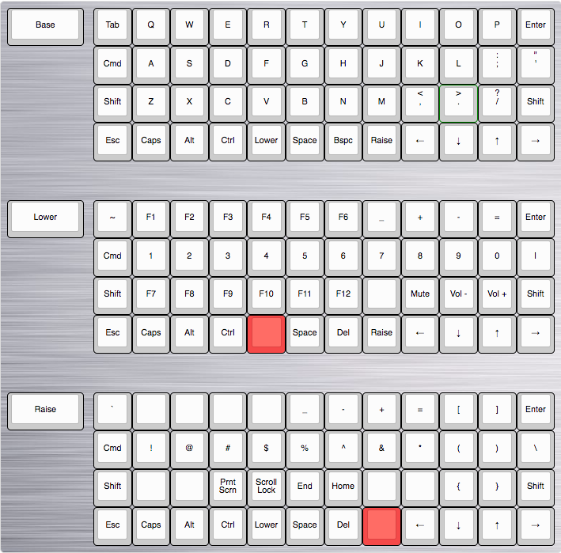

### Layout for Mac



### Flashing the Arduino
First, you need avrdude to flash the firmware: `brew install avrdude`

Clone the directory to get the firmware:
`git clone https://github.com/Brcrwilliams/qmk_firmware`

cd to Let's Split directory:
`cd qmk_firmware/keyboards/lets_split/`

Create the hex file that you will flash onto the Arduino:
`make rev2-custom_mac-build`
This can now be found in qmk_firmware/.build/

Next, we will run a script to find the serial port and then flash the firmware. Make sure that it is executable by running:
`chmod +x flash.sh`

In your terminal type `./flash.sh ../../.build/lets_split_rev2_custom_mac.hex` but **do not run it yet.**

The next three steps will have to be done in quick succession. First, run the flash.sh script. Next, connect your Arduino to the computer via USB. Then use a wire to connect the GRD and RST pins of the Arduino to cause it to enter bootloader mode. The script should then flash the firmware for you.

If you flashed successfully, the output will look like this:
```
Reset your Pro Micro now
Serial port identified: /dev/tty.usbmodem1421
Running avrdude

Connecting to programmer: .
Found programmer: Id = "CATERIN"; type = S
    Software Version = 1.0; No Hardware Version given.
Programmer supports auto addr increment.
Programmer supports buffered memory access with buffersize=128 bytes.

Programmer supports the following devices:
    Device code: 0x44

avrdude: AVR device initialized and ready to accept instructions

Reading | ################################################## | 100% 0.00s

avrdude: Device signature = 0x1e9587 (probably m32u4)
avrdude: NOTE: "flash" memory has been specified, an erase cycle will be performed
         To disable this feature, specify the -D option.
avrdude: erasing chip
avrdude: reading input file "../../.build/lets_split_rev2_custom_mac.hex"
avrdude: input file ../../.build/lets_split_rev2_custom_mac.hex auto detected as Intel Hex
avrdude: writing flash (18636 bytes):

Writing | ################################################## | 100% 1.47s

avrdude: 18636 bytes of flash written
avrdude: verifying flash memory against ../../.build/lets_split_rev2_custom_mac.hex:
avrdude: load data flash data from input file ../../.build/lets_split_rev2_custom_mac.hex:
avrdude: input file ../../.build/lets_split_rev2_custom_mac.hex auto detected as Intel Hex
avrdude: input file ../../.build/lets_split_rev2_custom_mac.hex contains 18636 bytes
avrdude: reading on-chip flash data:

Reading | ################################################## | 100% 0.18s

avrdude: verifying ...
avrdude: 18636 bytes of flash verified

avrdude: safemode: Fuses OK (E:FB, H:D8, L:FF)

avrdude done.  Thank you.
```

If you receive read/write errors, you most likely have a Mac with no COM port. You'll need to install the Virtual COM Port drivers found here: http://www.ftdichip.com/Drivers/VCP.htm
